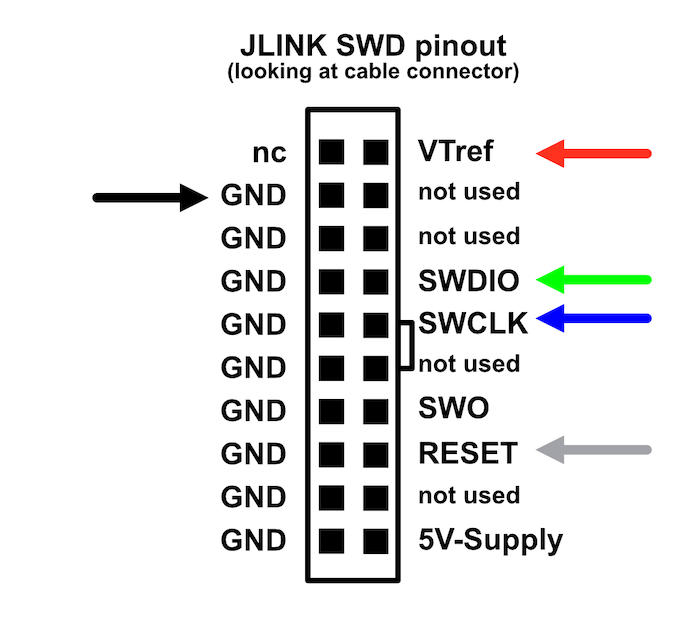
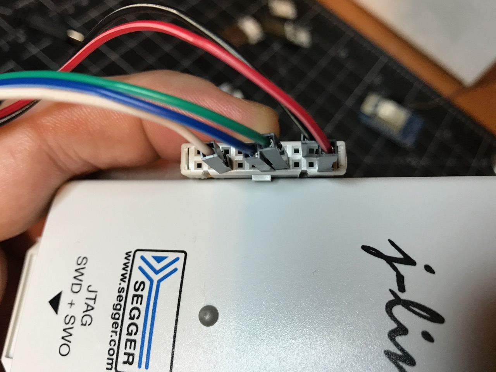
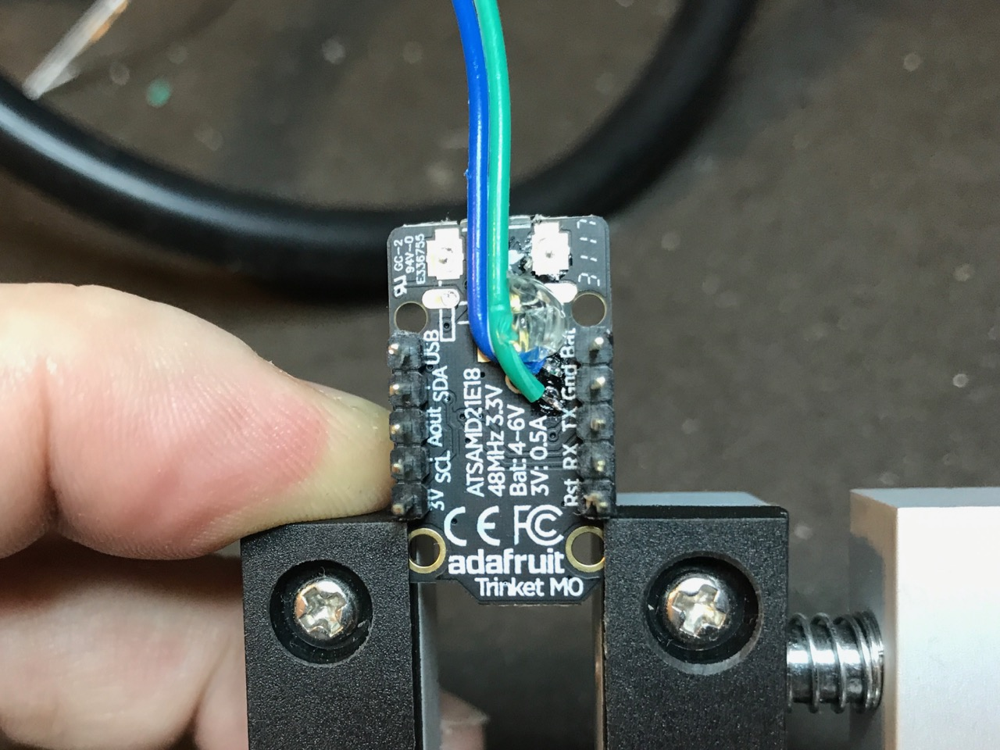
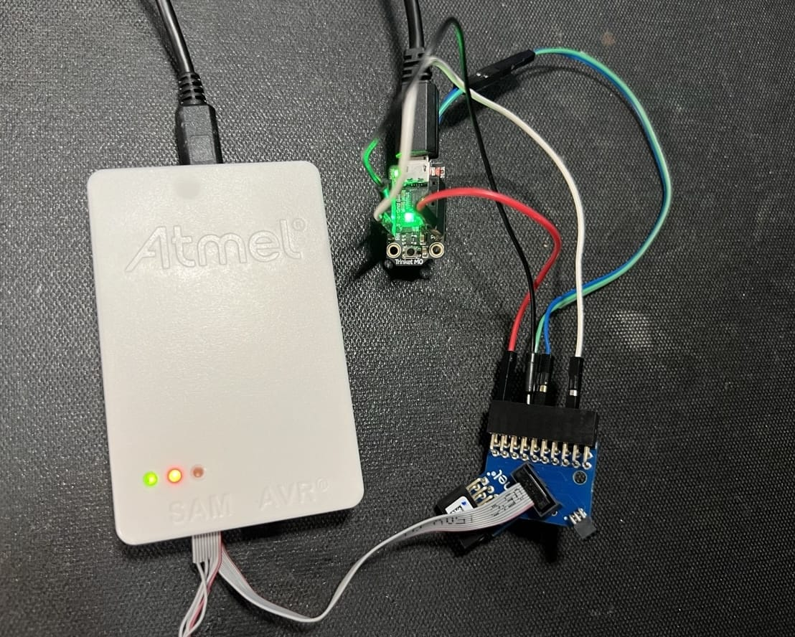
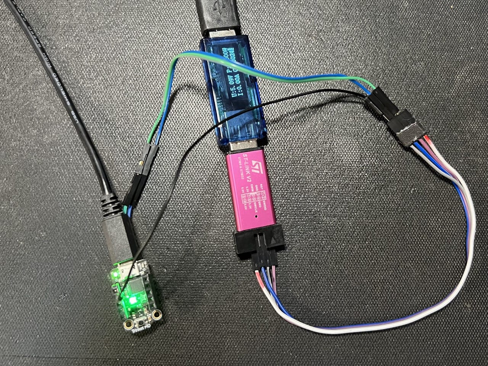

# SAMD21 Programming Notes

Explorations into how to program SAMD21 chips like those in
[Trinket M0](https://learn.adafruit.com/adafruit-trinket-m0-circuitpython-arduino/pinouts), 
Arduino Zero, etc.

How to program a SAMD21 (or other ARM chip really) using a variety of methods, 
in order to burn a [UF2 bootloader](https://github.com/Microsoft/uf2-samd21/) 
or my own programs.


Ways to program a SAMD21 board: (e.g. Trinket M0, QTPy M0, etc)

- Reprogram bootloader using UF2
- Program with Arduino sketches using uf2
- Talk to chip w/ GDB using JTAG/SWD programmer (OpenOCD / JLink via commandline, no Atmel Studio)
- Reprogram bootloader with JTAG/WWD programmer (OpenOCD / JLink via commandline, no Atmel Studio)
- Program chip with Arduino sketch using JTAG/SWD programmer


Progress so far...

### Reprogram bootloader via UF2 - Trinket M0 ###

1. Double-click button on Trinket M0 to get into UF2 bootloader
  - LED will heartbeat
  - Trinket M0 shows up as "TRINKETBOOT" disk
2. Create new UF2 bootloader
  ```
  git clone https://github.com/Microsoft/uf2-samd21/
  cd uf2-samd21
  make BOARD=trinket
  ```

3. Copy resulting file `update-bootloader.uf2` to disk
4. Tada, new bootloader installed
5. Edit file `boards/trinket/board_config.h` to change bootloader id strings

### Program Arduino sketch with UF2 - Trinket M0 ###

1. Create sketch as normal
2. Open build tmp directory and copy out .bin file
3. Use uf2-samd21 'bin2uf2.js' script (from 'scripts' in [uf2-samd21 repo](https://github.com/Microsoft/uf2-samd21/))
to convert to uf2:
  ```
  node uf2-samd21/scripts/bin2uf2.js sketch_nov24a.ino.bin sketch_nov24a.uf2
  ```
4. Copy uf2 file to TRINKETBOOT and tada programmed!
5. TODO: Look into what bin2uf2 is doing

### Connecting Jlink JTAG/SWD to Trinket M0 ###

1. Solder pads to SWD & SWC pins on back of Trinket M0
2. Connect following pins from JLink to Trinket M0:
```
  | black | Jlink Gnd   | Trinket M0 Gnd pin |
  | red   | Jlink VTref | Trinket M0 3v3 pin |
  | green | Jlink SWDIO | Trinket M0 SWD solder pad |
  | blue  | Jlink SWCLK | Trinket M0 SWC solder pad |
```

3. Power Trinket M0 via USB. Power Jlink via USB.

"VTref" is used to detect target power is applied. It is a signal TO the programmer.








### Update bootloader via JLink JTAG/SWD w/ uf2-samd21 - Trinket M0 ###

1. Connect Jlink to Trinket M0 as above
3. Install openocd with `brew install openocd`
4. Modify `uf2-samd21/scripts/dbgtool.js` to use Jlink instead of EDBG.
   - Change openocd path to use 0.1.0 or better:
         let openocdBin = "/usr/local/bin/openocd"
   - Modify `uf2-samd21/scripts/dbgtool.js`:
         let zeroCfg = '/Users/tod/projects/samd/openocd-scripts/samd21-jlink.cfg'
 5. Must have new openocd-script [samd21-jlink.cfg](./samd21-jlink.cfg):
 6. Run "`make burn`" in `uf2-samd21`
 7. Alternatively, run:
  ```
  cd uf2-samd21
  node ./scripts/dbgtool.js fuses
  node ./scripts/dbgtool.js ./build/trinket/bootloader.bin
  ```

### Update bootloader via OpenOCD and JLink on commandline - Trinket M0

1. Install `openocd` as above
2. Get [openocd_jlink_samd21.cfg](./openocd_jlink_samd21.cfg)
3. Get the `bootloader-trinket_m0-v3.16.0.bin` file from [adafruit/uf2-samdx1](https://github.com/adafruit/uf2-samdx1/releases)
4. Connect Jlink to Trinket M0 as above
5. Program on commandline:
   ```
   openocd -f ./openocd_jlink_samd21.cfg \
      -c "init; targets; halt; " \
      -c "at91samd bootloader 0;" \
      -c "program bootloader-trinket_m0-v3.16.0.bin verify;" \
      -c "at91samd bootloader 8192; reset; shutdown" 
    ```
    
    **NOTE:** the `at91samd bootloader 0;` disables bootloader protection and 
    allows you to rewrite the bootloader. The `at91samd bootloader 8192;`
    re-enables bootloader protection.
    (from this [adfruit forum post](https://forums.adafruit.com/viewtopic.php?t=204268))
    
6. Can also erase entire chip  (assuming no bootloader lock):
   ```
   openocd -f ./openocd_jlink_samd21.cfg -c "init; targets; at91samd chip-erase; shutdown"`
   ```
   or in a more general way:
   ```
   openocd -f ./openocd_jlink_samd21.cfg -c "init; targets; flash erase_sector 0 1 last; shutdown"`
   ```
   
7. Or list which targets are connected:
   ```
   openocd -f openocd_jlink_samd21.cfg -c "init; targets; shutdown"
   ```


- TODO: Get programming to work for Arduino sketches
  (specifically, can program but sketch doesn't run)

8. TODO: try:

   `-c "init; targets; reset halt; program sketch.bin 0x00002000`

### Update bootlaoder via OpenOCD and Atmel ICE on the commandline - Trinket M0

1. Install `openocd` and get `bootloader-xxx.bin` 
2. Get [openocd_atmel-ice_samd21.cfg](./openocd_atmel-ice_samd21.cfg)
3. Connect Atmel ICE similar to JLink by using adapter like in image below
4. Program on commandline:
   ```
   openocd -f ./openocd_jlink_samd21.cfg \
      -c "init; targets; halt; " \
      -c "at91samd bootloader 0;" \
      -c "program bootloader-trinket_m0-v3.16.0.bin verify;" \
      -c "at91samd bootloader 8192; reset; shutdown" 
    ```
    
    **NOTE:** the `at91samd bootloader 0;` disables bootloader protection and 
    allows you to rewrite the bootloader. The `at91samd bootloader 8192;`
    re-enables bootloader protection.
    (from this [adfruit forum post](https://forums.adafruit.com/viewtopic.php?t=204268))
    
    
  
  
5. You can also choose to install `telnet` and do these commands interactively:

  In one terminal window run `openocd`:
  ```
% openocd -f ./openocd_atmel-ice_samd21.cfg 
Open On-Chip Debugger 0.12.0
Licensed under GNU GPL v2
For bug reports, read
   http://openocd.org/doc/doxygen/bugs.html
Info : auto-selecting first available session transport "swd". To override use 'transport select <transport>'.
Info : Listening on port 6666 for tcl connections
Info : Listening on port 4444 for telnet connections
Info : CMSIS-DAP: SWD supported
Info : CMSIS-DAP: JTAG supported
Info : CMSIS-DAP: FW Version = 01.00.0021
Info : CMSIS-DAP: Serial# = J41800054170
Info : CMSIS-DAP: Interface Initialised (SWD)
Info : SWCLK/TCK = 1 SWDIO/TMS = 1 TDI = 1 TDO = 1 nTRST = 0 nRESET = 1
Info : CMSIS-DAP: Interface ready
Info : clock speed 400 kHz
Info : SWD DPIDR 0x0bc11477
Info : [at91samd21e18.cpu] Cortex-M0+ r0p1 processor detected
Info : [at91samd21e18.cpu] target has 4 breakpoints, 2 watchpoints
Info : starting gdb server for at91samd21e18.cpu on 3333
Info : Listening on port 3333 for gdb connections
  ```

  And in another terminal window, run `telnet` and then openocd commands:

  ```
% telnet localhost 4444     
Trying ::1...
telnet: connect to address ::1: Connection refused
Trying 127.0.0.1...
Connected to localhost.
Escape character is '^]'.
Open On-Chip Debugger

> targets
    TargetName         Type       Endian TapName            State       
--  ------------------ ---------- ------ ------------------ ------------
 0* at91samd21e18.cpu  cortex_m   little at91samd21e18.cpu  running

> reset halt                                                                 
[at91samd21e18.cpu] halted due to debug-request, current mode: Thread 
xPSR: 0x21000000 pc: 0x00000264 msp: 0x20002de0

> at91samd bootloader 0

> flash erase_sector 0 1 last                   
SAMD MCU: SAMD21E18A (256KB Flash, 32KB RAM)
erased sectors 1 through 1023 on flash bank 0 in 6.106292s

> program bootloader-trinket_m0-v3.16.0.bin verify 
[at91samd21e18.cpu] halted due to debug-request, current mode: Thread 
xPSR: 0x21000000 pc: 0x00000264 msp: 0x20002de0
** Programming Started **
** Programming Finished **
** Verify Started **
** Verified OK **

> at91samd bootloader 8192

> reset
> shutdown
  ```

### Update bootlaoder via OpenOCD and STLink v2 - Trinket M0

1. Install `openocd` and get `bootloader-xxx.bin` 
2. Get [openocd_stlink_samd21.cfg](./openocd_stlink_samd21.cfg)
3. Connect Trinket M0 to STLink using only: GND, SWDIO, SWCLK, as in image below
 
4. Program on commandline:
   ```
   openocd -f ./openocd_atmel-ice_samd21.cfg \
      -c "init; targets; halt; program bootloader-trinket_m0-v3.16.0.bin verify reset; shutdown"
    ```
  

5. Or interactively:

  ```
% telnet localhost 4444
Trying ::1...
telnet: connect to address ::1: Connection refused
Trying 127.0.0.1...
Connected to localhost.
Escape character is '^]'.
Open On-Chip Debugger

> reset halt                  
[at91samd21g18a.cpu] halted due to debug-request, current mode: Thread 
xPSR: 0x61000000 pc: 0x00000264 msp: 0x20002de0
> targets                                                                    
    TargetName         Type       Endian TapName            State       
--  ------------------ ---------- ------ ------------------ ------------
 0* at91samd21g18a.cpu hla_target little at91samd21g18a.cpu halted

> flash erase_sector 0 1 last                                                
SAMD MCU: SAMD21E18A (256KB Flash, 32KB RAM)
erased sectors 1 through 1023 on flash bank 0 in 5.069648s

> program /Users/tod/Downloads/bootloader-trinket_m0-v3.16.0.bin verify reset
[at91samd21g18a.cpu] halted due to debug-request, current mode: Thread 
xPSR: 0x61000000 pc: 0x00000264 msp: 0x20002de0
** Programming Started **
** Programming Finished **
** Verify Started **
** Verified OK **
** Resetting Target **
  ```


### Useful links: ###
- https://learn.adafruit.com/adafruit-feather-m0-express-designed-for-circuit-python-circuitpython/uf2-bootloader-details
- https://learn.adafruit.com/debugging-the-samd21-with-gdb/setup
- https://learn.adafruit.com/proper-step-debugging-atsamd21-arduino-zero-m0/lets-go
- http://www.instructables.com/id/ATSAMD21g18-Bootloader-With-J-link-Debugger/
- https://github.com/geomatsi/stm32-tests/blob/master/boards/stm32f103-mini/scripts/openocd-jlink-swd.cfg
- https://learn.adafruit.com/programming-microcontrollers-using-openocd-on-raspberry-pi/wiring-and-test
- https://omzlo.com/articles/programming-the-samd21-using-atmel-ice-with-openocd-(updated)
