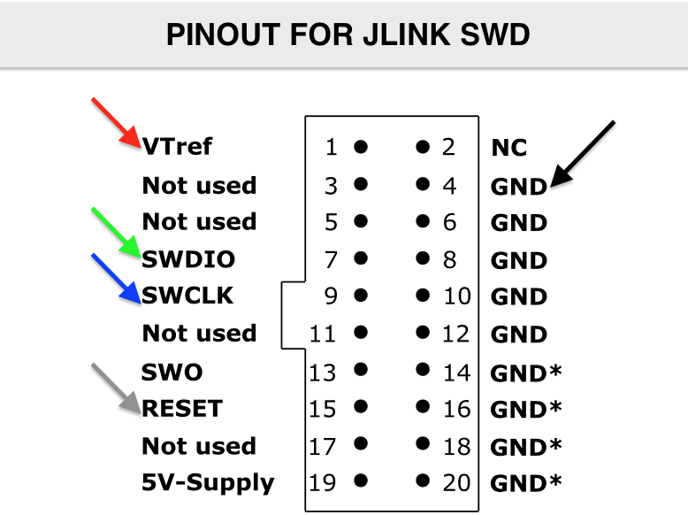

# SAMD21 Programming Notes

Explorations into how to program SAMD21 chips like those in Trinket M0, Arduino Zero, etc.

Eventual goal: Build a crystalless SAMD21-based board and program it with a combined bin of a [UF2 bootloader](https://github.com/Microsoft/uf2-samd21/) and my own program.

One preliminary idea is:


Steps to get there using existing SAMD21 board (e.g. Trinket M0, FemtoUSB):
1. Reprogram bootloader using UF2
2. Program chip with an Arduino sketches using uf2
3. Talk to chip w/ GDB using JTAG programmer (JLink via commandline, no Atmel Studio)
3. Reprogram bootloader with JTAG programmer (JLink via commandline, no Atmel Studio)
4. Program chip with Arduino sketch using JTAG programmer


Progress so far...

### Reprogram bootloader via UF2 - Trinket M0 ###
1. Double-click button on Trinket M0 to get into UF2 bootloader
  - LED will heartbeat
  - Trinket M0 shows up as "TRINKETBOOT" disk
2. Create new UF2 bootloader
  ```
  git clone https://github.com/Microsoft/uf2-samd21/
  cd uf2-samd21
  make BOARD=trinket
  ```

3. Copy resulting file `update-bootloader.uf2` to disk
4. Tada, new bootloader installed
5. Edit file `boards/trinket/board_config.h` to change bootloader id strings

### Program Arduino sketch with UF2 - Trinket M0 ###
1. Create sketch as normal
2. Open build tmp directory and copy out .bin file
3. Use uf2-samd21 'bin2uf2.js' script to convert to uf2:
  ```
  node uf2-samd21/scripts/bin2uf2.js sketch_nov24a.ino.bin sketch_nov24a.uf2
  ```
4. Copy uf2 file to TRINKETBOOT and tada programmed!
5. TODO: Look into what bin2uf2 is doing

### Connecting Jlink JTAG/SWD to Trinket M0 ###
1. Solder pads to SWD & SWC pins on back of Trinket M0
2. Connect following pins from JLink to Trinket M0:
```
  | black | Jlink Gnd   | Trinket M0 Gnd pin |
  | red   | Jlink VTref | Trinket M0 3v3 pin |
  | green | Jlink SWDIO | Trinket M0 SWD solder pad |
  | blue  | Jlink SWCLK | Trinket M0 SWC solder pad |
```
3. Power Trinket M0 via USB. Power Jlink via USB.
"VTref" is used to detect target power is applied.




### GDB to chip via Jlink JTAG/SWD  - Trinket M0 ###

1. Connect Jlink to Trinket M0 as above
2. Mostly from: https://learn.adafruit.com/debugging-the-samd21-with-gdb/
3. Install J-Link software from https://www.segger.com/downloads/jlink/
4. Run `/Applications/SEGGER/JLink/JLinkGDBServer -if SWD -device ATSAMD21E18 -port 3333`
5. Run `arm-none-eabi-gdb-py`
  - set `target extended-remote :2331` (if not doing port 3333 above)
6. In GDB, do standard GDB things


### Update bootloader via JLink JTAG/SWD w/ uf2-samd21 - Trinket M0 ###
1. Connect Jlink to Trinket M0 as above
2. Uses OpenOCD, but expects EDBG instead of Jlink
3. Install openocd with `brew install openocd`
4. Modify `uf2-samd21/scripts/dbgtool.js` to use Jlink instead of EDBG.
   - Change openocd path to use 0.1.0 or better:
         let openocdBin = "/usr/local/bin/openocd"
   - Modify `uf2-samd21/scripts/dbgtool.js`:
         let zeroCfg = '/Users/tod/projects/samd/openocd-scripts/samd21-jlink.cfg'
 5. Must have new openocd-script [samd21-jlink.cfg](./samd21-jlink.cfg):
 6. Run "`make burn`" in `uf2-samd21`
 7. Alternatively, run:
  ```
  cd uf2-samd21
  node ./scripts/dbgtool.js fuses
  node ./scripts/dbgtool.js ./build/trinket/bootloader.bin
  ```

### Update bootloader via JLink on commandline - Trinket M0
1. Connect Jlink to Trinket M0 as above
2. Install `openocd` as above
3. Get [samd21-jlink.cfg](./samd21-jlink.cfg) as above
4. Program on commandline:
   ```
     /usr/local/bin/openocd \
      -s /usr/local/share/openocd/scripts \
      -f ~/projects/samd/openocd-scripts/samd21-jlink.cfg \
      -c "init; targets; halt; program /Users/tod/projects/samd/uf2-samd21/build/trinket/bootloader.bin verify reset; shutdown"
    ```
5. Can also erase entire chip:
   ```
   openocd -f ~/projects/samd/openocd-scripts/samd21-jlink.cfg -c "init; targets; at91samd chip-erase; shutdown"`
   ```
6. Or just list which targets are connected:
   ```
     openocd -f ~/projects/samd/openocd-scripts/samd21-jlink.cfg -c "init; targets; shutdown"
   ```


- TODO: Get programming to work for Arduino sketches
  (specifically, can program but sketch doesn't run)

6. TODO: try:

   `-c "init; targets; reset halt; program sketch.bin 0x00002000`


### Useful links: ###
- https://learn.adafruit.com/adafruit-feather-m0-express-designed-for-circuit-python-circuitpython/uf2-bootloader-details
- https://learn.adafruit.com/debugging-the-samd21-with-gdb/setup
- https://learn.adafruit.com/proper-step-debugging-atsamd21-arduino-zero-m0/lets-go
- http://www.instructables.com/id/ATSAMD21g18-Bootloader-With-J-link-Debugger/
- https://github.com/geomatsi/stm32-tests/blob/master/boards/stm32f103-mini/scripts/openocd-jlink-swd.cfg
- https://learn.adafruit.com/programming-microcontrollers-using-openocd-on-raspberry-pi/wiring-and-test
